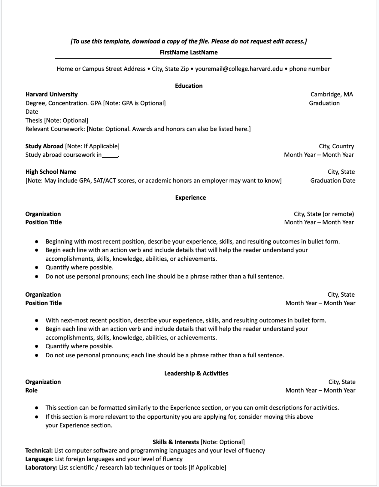

# Frontend Technical Specifications

Create a static website that serves an HTML Resume.

## Resume format considerations

I'm going to use the [Harvard resume template](https://careerservices.fas.harvard.edu/resources/bullet-point-resume-template/) as the basis of my resume

## Harvard Resume Format Generation
I know HTML very well, therefore I will let GenAI do the heavy lifting as well as the CSS. From there I will manually refractor the code to my liking.

Promt to Claude:

```text
Convert this resume format in to HTMl.
Please dont use a CSS framework.
Please use the least amount of CSS tags.
```

Image provided to LLM


This is the [generated output](./docs/02-02-26harvard_resume_template.html) which I will refractor.